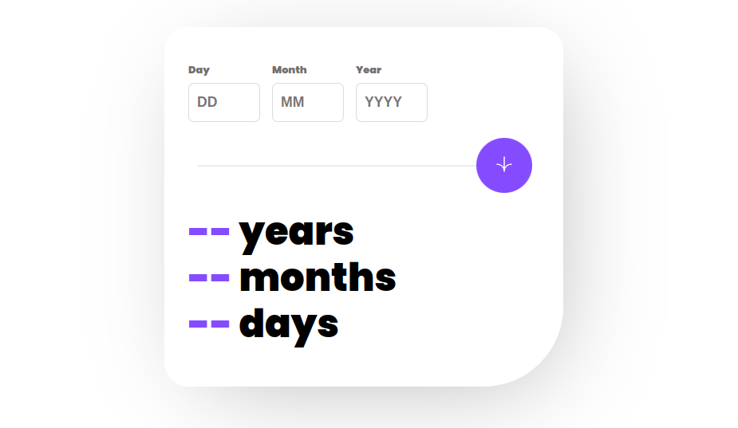

# age-calculator-app

This Age Calculator App allows you to calculate your age based on the input date. It provides the number of years, months, and days since the specified date up to the current date.

## Features

- Enter a valid date to calculate your age in years, months, and days.
- The app validates the input date to ensure it is within a valid range.
- The app prevents entering future dates as input.
- The calculated age is displayed in real-time.

## Technologies Used

- HTML
- CSS
- JavaScript

## Getting Started

These instructions will help you set up the project on your local machine for development and testing purposes.

1. Clone the repository:

```
git clone https://github.com/shahinovic/age-calculator-app.git
```

2. Open the project in your preferred code editor.

3. Run the application on a local server or open the `index.html` file in your web browser.

## Usage

1. Open the Age Calculator App in your web browser.

2. Enter a valid date in the input fields for day, month, and year.

3. Click the "Calculate" button to calculate your age.

4. The calculated age will be displayed in the output fields.

## Screenshots



## Contributing

Contributions are welcome! If you find any issues or have suggestions for improvements, feel free to create an issue or submit a pull request.

## License

This project is licensed under the [MIT License](LICENSE).

## Acknowledgments

- This project was completed as part of the [Frontend Mentor](https://www.frontendmentor.io) coding challenge.

```

```
